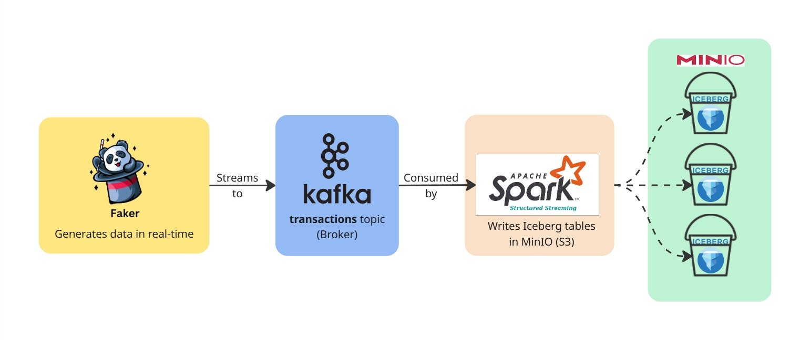

# 🧠 Real-Time Data Lakehouse with Spark, Kafka & Iceberg

This project demonstrates a **real-time data lakehouse architecture** built using **Apache Spark**, **Apache Kafka**, and **Apache Iceberg**, with **MinIO** as the S3-compatible object store.  
It simulates live transaction streams, processes them in real time with Spark Structured Streaming, and stores them in an Iceberg table for analytics.

---

## 🚀 Architecture Overview



**Flow Summary:**
1. `transaction_producer.py` continuously generates random financial transactions using the **Faker** library.
2. These messages are published to a Kafka topic named `transactions`.
3. A **Spark Structured Streaming** job consumes this topic in real time.
4. Spark writes the parsed transaction data into an **Iceberg table** stored in **MinIO (S3)**.

---

## 🧰 Tech Stack

| Component | Description |
|------------|-------------|
| **Apache Kafka** | Message broker for real-time data streaming |
| **Apache Spark** | Stream processing engine |
| **Apache Iceberg** | Lakehouse table format with ACID guarantees |
| **MinIO** | S3-compatible object storage |
| **Docker Compose** | Container orchestration |
| **Python + Faker** | Synthetic data generation |

---


---

## ⚙️ Setup Instructions

### 1️⃣ Prerequisites
Ensure you have:
- 🐳 **Docker** and **Docker Compose** installed
- 🐍 **Python 3.8+** with `pip install kafka-python faker`

---

## 🚀 Step 2: Start All Containers

From the project root directory, run:

```bash
docker-compose up -d
```

This command spins up the following services:

- 🧩 **Kafka Broker** — message streaming platform  
- ⚙️ **Spark Master & Worker** — distributed processing engine  
- 💾 **MinIO Object Storage** — S3-compatible data lake storage  

### ✅ Verify the Services

You can confirm that everything is running by visiting the following URLs:

| Service | URL | Default Credentials |
|----------|-----|---------------------|
| **Spark Master UI** | [http://localhost:8080](http://localhost:8080) | — |
| **MinIO Console** | [http://localhost:9001](http://localhost:9001) | **Username:** `minio` <br> **Password:** `minio123` |

---

## 💸 Step 3: Start the Transaction Producer

This script simulates live transactions and streams them to **Kafka** every second.

Run the producer script:

```bash
python transaction_producer.py
```

You should start seeing logs like:

```
Sent: {'txn_id': '...', 'user_id': 1423, 'amount': 134.22, 'currency': 'MYR', ...}
```


## ⚡ Step 4: Start Spark Structured Streaming

At the same time, open another terminal and run the following command **inside the Spark container** to start the stream:

```bash
docker exec -it spark \
  /opt/spark/bin/spark-submit \
  --conf spark.sql.extensions=org.apache.iceberg.spark.extensions.IcebergSparkSessionExtensions \
  /app/spark_to_iceberg.py
```

This will:

- 🔄 Read data from **Kafka** (`transactions` topic)  
- 🧮 Parse and transform **JSON** messages  
- 🧊 Write them continuously to an **Iceberg table** stored in **MinIO**

---

## 🔍 Step 5: Verify Iceberg Data

To inspect the ingested data, open a **PySpark shell** inside the Spark container:

```bash
docker exec -it spark /opt/spark/bin/pyspark \
  --conf spark.sql.extensions=org.apache.iceberg.spark.extensions.IcebergSparkSessionExtensions
```

Then run the following query:

```python
spark.sql("SELECT * FROM local.default.transactions LIMIT 10").show()
```

You should see live transactions being stored in your Iceberg table.

---

## 🧠 How It Works

**Data Flow Overview**

```
Kafka → Spark Structured Streaming → Iceberg → MinIO
```

**Explanation**

- ⚙️ **Kafka → Spark Streaming**: Spark continuously polls Kafka for new messages.  
- 🧮 **Spark → Iceberg**: Each micro-batch is written atomically into an Iceberg table.  
- 💾 **Iceberg → MinIO**: Iceberg metadata and Parquet files are stored in MinIO.  
- 🧬 **Schema Evolution**: Iceberg supports schema changes without rewriting data.  
- 🔒 **ACID Guarantees**: Every write operation is consistent, isolated, and reliable.


## ⚡ Quick Start (TL;DR)

Get the entire pipeline running in just a few commands 🚀

```bash
# 1️⃣ Start all containers
docker-compose up -d

# 2️⃣ Start producing transactions
python transaction_producer.py

# 3️⃣ Start Spark stream
docker exec -it spark \
  /opt/spark/bin/spark-submit \
  --conf spark.sql.extensions=org.apache.iceberg.spark.extensions.IcebergSparkSessionExtensions \
  /app/spark_to_iceberg.py
```
